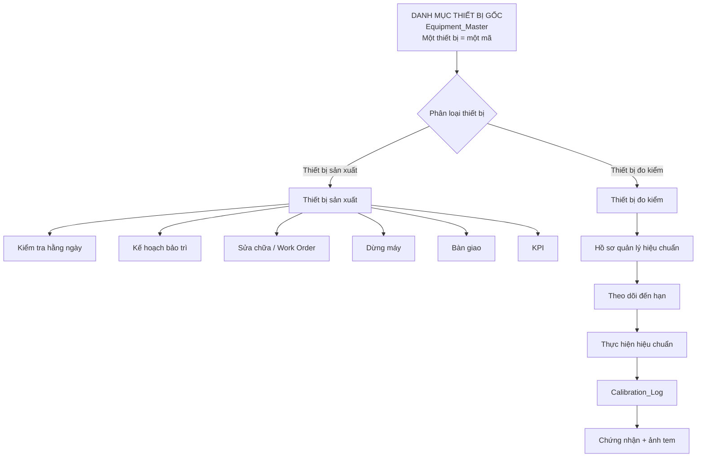
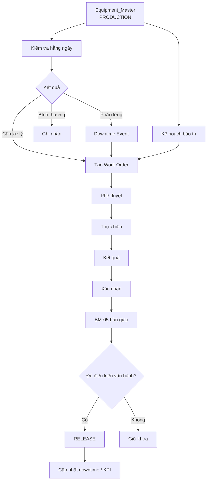
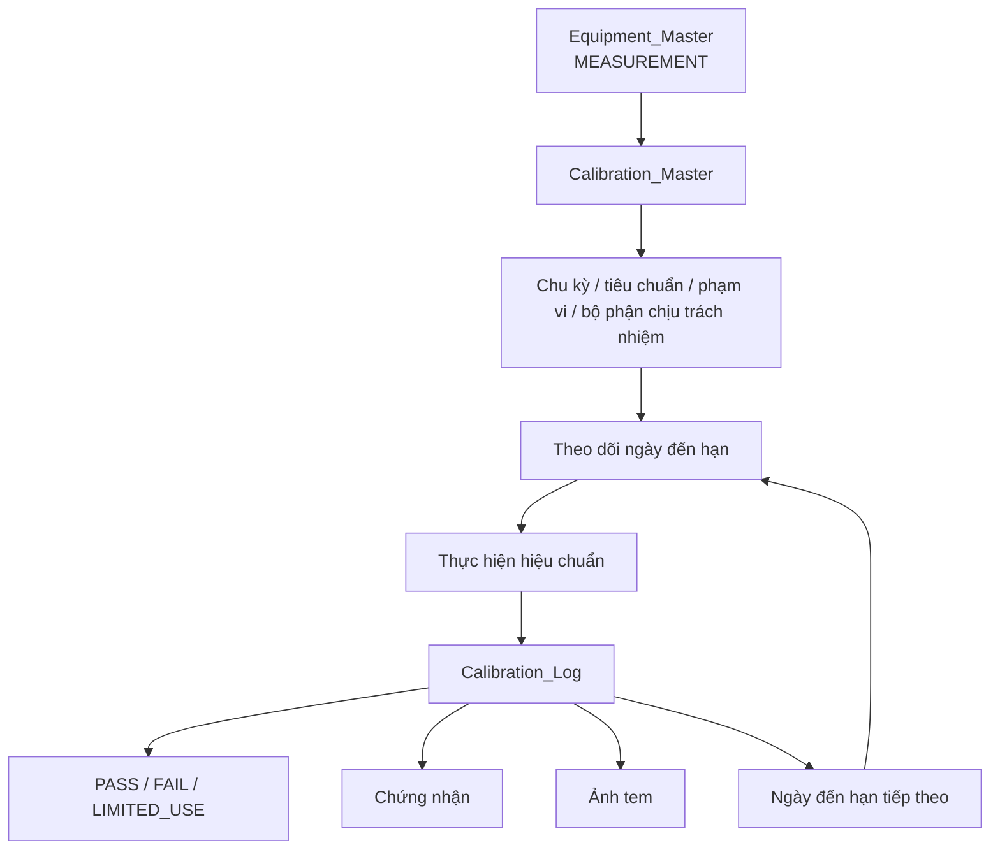
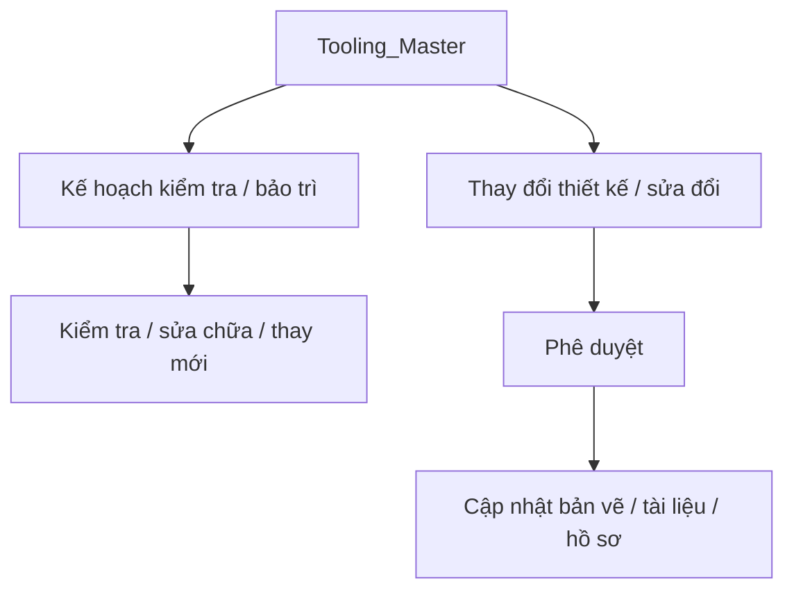
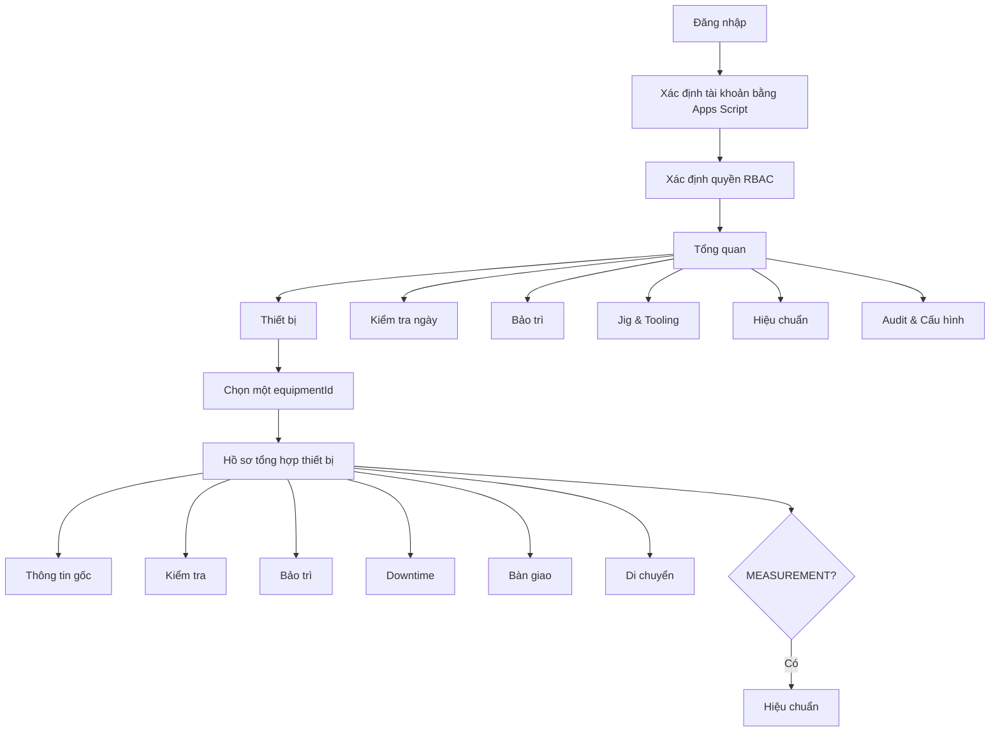

# Kiến trúc luồng hệ thống quản lý thiết bị

> Trạng thái: Đã duyệt nguyên tắc kiến trúc
>
> Nguyên tắc bắt buộc: **một thiết bị = một mã = một hồ sơ gốc = một lịch sử xuyên suốt**.

## 1. Nguyên tắc dữ liệu gốc

`Equipment_Master` là danh mục gốc duy nhất của toàn bộ thiết bị.

Không được tạo nhiều mã cho cùng một thiết bị theo từng phòng ban hoặc từng nghiệp vụ. Phòng Kỹ thuật, Sản xuất, Chất lượng, Bảo trì và Hiệu chuẩn đều sử dụng cùng `equipmentId`.

Không được dùng `Calibration_Master`, bảo trì, kiểm tra ngày hoặc hồ sơ bàn giao như một danh mục thiết bị độc lập.



## 2. Hai nhánh thiết bị

Hệ thống chỉ phân loại thiết bị trong hồ sơ gốc thành:

- `PRODUCTION`: thiết bị sản xuất.
- `MEASUREMENT`: thiết bị đo kiểm / QC.

Đây là **hai loại của cùng một danh mục**, không phải hai hệ thống mã khác nhau.

Ví dụ:

```text
TB-0001 → PRODUCTION → kiểm tra ngày / bảo trì / downtime / bàn giao
TB-0052 → MEASUREMENT → hiệu chuẩn / certificate / tem / lịch sử hiệu chuẩn
```

Không được tạo thêm `QC-xxx`, `CAL-xxx` hoặc mã bộ phận khác cho cùng thiết bị nếu thiết bị đã có `equipmentId`.

Nếu cần giữ mã cũ của bộ phận thì chỉ dùng làm mã tham chiếu, không dùng làm khóa chính.

## 3. Equipment Master

`Equipment_Master` lưu trạng thái hiện tại và thông tin gốc của thiết bị, theo BM-TBSX-01/BM-TBSX-02:

- mã thiết bị;
- tên thiết bị;
- loại thiết bị;
- model / serial;
- nhà sản xuất / nhà cung cấp;
- năm sản xuất;
- ngày mua / ngày đưa vào sử dụng;
- khu vực / dây chuyền;
- bộ phận quản lý / sử dụng;
- thông số kỹ thuật;
- chu kỳ bảo trì;
- trạng thái;
- mức độ quan trọng;
- tài liệu / hình ảnh;
- QR;
- trạng thái còn sử dụng;
- thời điểm cập nhật cuối.

Thông tin này không được sao chép thành các bản master mới ở module khác.

## 4. Quản trị Equipment Master

### 4.1 Thêm thiết bị

Chỉ `ADMIN` được thêm thiết bị trong giai đoạn hiện tại.

Luồng:

```text
Admin tạo thiết bị
→ hệ thống cấp equipmentId
→ chọn PRODUCTION hoặc MEASUREMENT
→ nhập thông tin BM-01/BM-02
→ lưu Equipment_Master
→ ghi Audit_Log
```

`equipmentId` do hệ thống cấp và không cho người dùng tự thay đổi sau khi thiết bị đã phát sinh nghiệp vụ.

### 4.2 Sửa thông tin

Chỉnh sửa phải giữ nguyên `equipmentId`.

Mọi thay đổi phải ghi `Audit_Log` gồm giá trị trước và sau.

### 4.3 Ngừng sử dụng / thanh lý

Không xóa vật lý thiết bị đã có lịch sử.

Sử dụng:

- `active = false` khi ngừng quản lý hoạt động;
- `status = DISPOSED` khi đã thanh lý.

### 4.4 Xóa thiết bị

Chỉ `ADMIN` được xóa và chỉ khi thiết bị **chưa có bất kỳ nghiệp vụ liên quan**.

Nếu đã có một trong các dữ liệu sau thì cấm xóa:

- kiểm tra hằng ngày;
- kế hoạch bảo trì;
- Work Order;
- thực hiện bảo trì;
- lịch sử bảo trì;
- bàn giao;
- downtime;
- hiệu chuẩn;
- di chuyển;
- dữ liệu nghiệp vụ khác tham chiếu `equipmentId`.

Khi đã có lịch sử, chỉ được ngừng sử dụng hoặc thanh lý.

## 5. Luồng thiết bị sản xuất



Mọi bảng trên đều dùng cùng `equipmentId` từ `Equipment_Master`.

## 6. Luồng thiết bị đo kiểm và hiệu chuẩn

`Calibration_Master` không phải danh mục thiết bị độc lập. Nó chỉ chứa thông tin nghiệp vụ hiệu chuẩn của thiết bị `MEASUREMENT` đã tồn tại trong `Equipment_Master`.



Tên thiết bị, serial, nhà sản xuất, vị trí và bộ phận sử dụng phải đọc từ `Equipment_Master`, không nhập lại thành một master khác.

Mỗi lần hiệu chuẩn có mã giao dịch riêng nhưng không tạo mã thiết bị mới.

## 7. Dụng cụ sản xuất

Jig, gá, khuôn và dụng cụ sản xuất được quản lý trong `Tooling_Master` vì đây là đối tượng nghiệp vụ khác thiết bị.



Không trộn `Tooling_Master` với `Equipment_Master` và không trộn dụng cụ sản xuất với thiết bị đo kiểm.

## 8. Luồng người dùng



## 9. Quy tắc nhập dữ liệu một lần

Ví dụ thiết bị đo:

```text
Equipment_Master
TB-0052
Tên: Panme Mitutoyo
Serial: 123456
Bộ phận sử dụng: Chất lượng
```

Khi tạo lần hiệu chuẩn, màn hình phải tự lấy các thông tin trên và người dùng chỉ nhập dữ liệu của lần hiệu chuẩn:

- ngày hiệu chuẩn;
- kết quả;
- nhà cung cấp;
- số chứng nhận;
- ngày đến hạn tiếp theo;
- certificate / ảnh tem.

## 10. Quy tắc bắt buộc cho mọi dev

Không được:

1. tạo thiết bị mới từ màn hình bảo trì;
2. tạo thiết bị mới từ màn hình hiệu chuẩn;
3. tạo mã QC riêng cho thiết bị đã có `equipmentId`;
4. tạo mã hiệu chuẩn thay thế `equipmentId`;
5. nhập lại tên/serial/vị trí của thiết bị ở mỗi bảng giao dịch;
6. đổi `equipmentId` sau khi đã có lịch sử;
7. xóa vật lý thiết bị đã có giao dịch;
8. để mỗi phòng ban duy trì một danh mục thiết bị riêng.

Mọi nghiệp vụ phải tham chiếu về cùng `equipmentId`.

## 11. Thứ tự triển khai

```text
1. Khóa kiến trúc một thiết bị = một mã
2. Hoàn thiện quản trị Equipment_Master
3. Thêm / sửa / ngừng sử dụng / thanh lý / xóa an toàn
4. Phân nhánh PRODUCTION / MEASUREMENT
5. Hoàn thiện liên kết bảo trì với Equipment_Master
6. Chuẩn hóa Calibration_Master là hồ sơ con của MEASUREMENT
7. Calibration live
8. Tooling live
9. KPI live
10. Optimistic concurrency cho các luồng cập nhật
11. Full integration test
12. Chỉ merge khi toàn bộ live gate đạt
```

## 12. Nguồn chuẩn

- `source/BM-TBSX-01 Lý lịch thiết bị.md`
- `source/BM-TBSX-02 Danh mục quản lý thiết bị sản xuất.md`
- `source/00 Mục lục - Hệ thống Quản lý Thiết bị.md`
- `docs/SOURCE_FIRST_IMPLEMENTATION_PLAN.md`
- `src/domain/models.ts`
- `src/domain/persistenceContract.ts`

Tài liệu này là nguyên tắc kiến trúc để dev không triển khai mỗi module theo một hệ mã hoặc một danh mục riêng.
