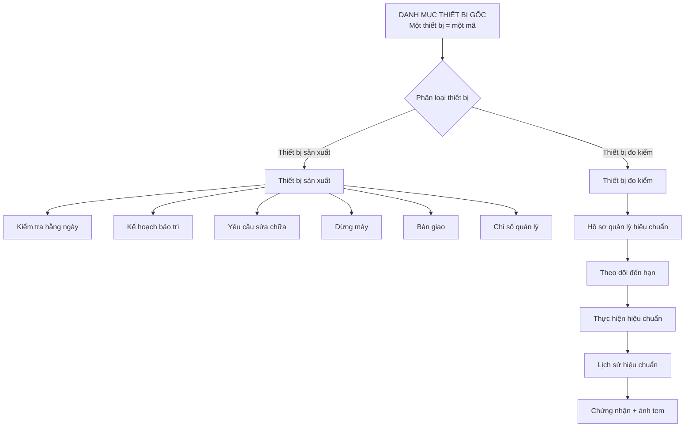
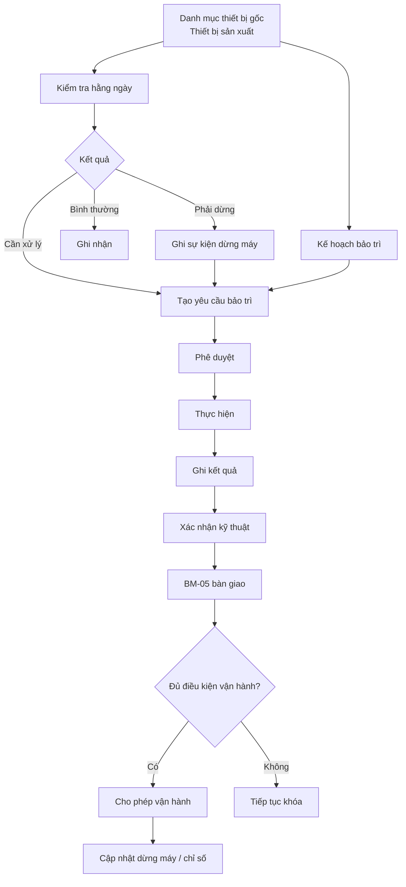
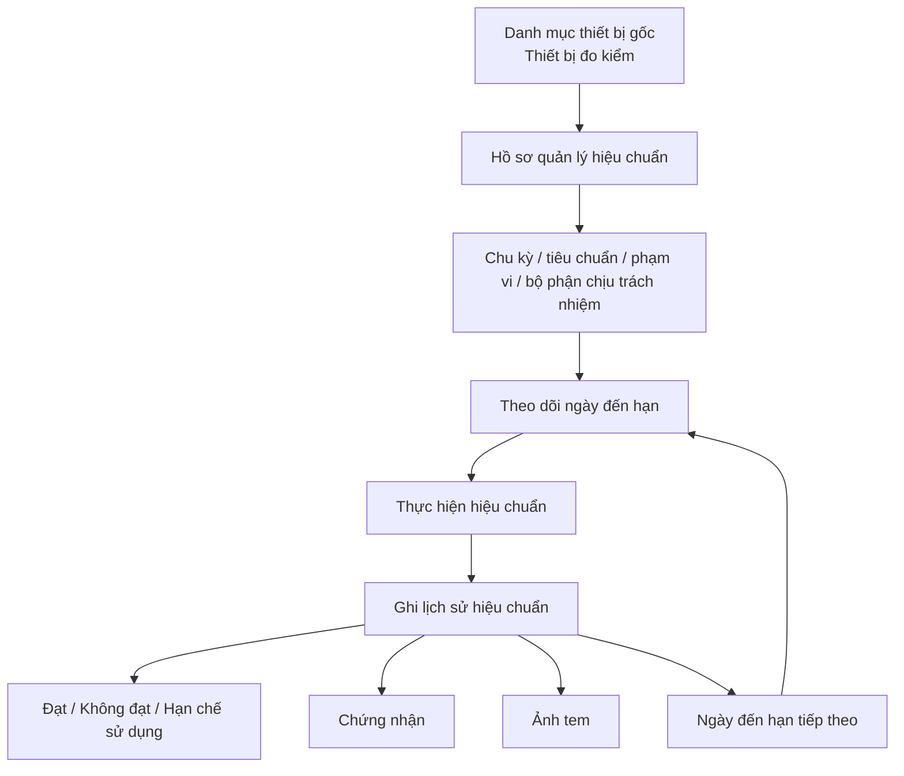
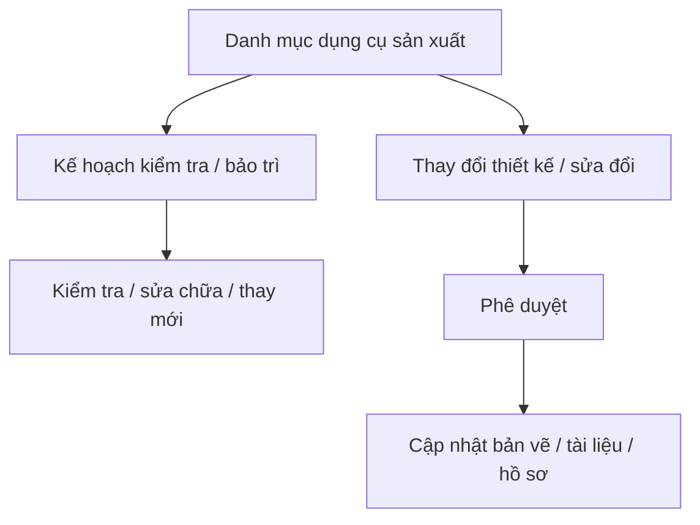
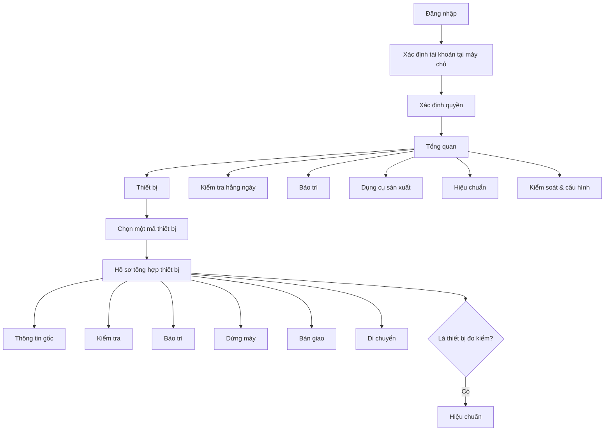

# Kiến trúc luồng hệ thống quản lý thiết bị

> Trạng thái: Đã duyệt nguyên tắc kiến trúc
>
> Nguyên tắc bắt buộc: **một thiết bị = một mã = một hồ sơ gốc = một lịch sử xuyên suốt**.

## 1. Nguyên tắc dữ liệu gốc

Bảng `Equipment_Master` là danh mục gốc duy nhất của toàn bộ thiết bị.

Không được tạo nhiều mã cho cùng một thiết bị theo từng phòng ban hoặc từng nghiệp vụ. Phòng Kỹ thuật, Sản xuất, Chất lượng, Bảo trì và bộ phận hiệu chuẩn đều sử dụng cùng `equipmentId`.

Không được dùng bảng hiệu chuẩn, bảo trì, kiểm tra hằng ngày hoặc hồ sơ bàn giao như một danh mục thiết bị độc lập.



## 2. Hai nhánh thiết bị

Trong dữ liệu kỹ thuật, hệ thống dùng hai giá trị để phân loại:

- `PRODUCTION`: thiết bị sản xuất.
- `MEASUREMENT`: thiết bị đo kiểm.

Đây là **hai loại của cùng một danh mục**, không phải hai hệ thống mã khác nhau.

Ví dụ:

```text
TB-0001 → thiết bị sản xuất → kiểm tra / bảo trì / dừng máy / bàn giao
TB-0052 → thiết bị đo kiểm → hiệu chuẩn / chứng nhận / tem / lịch sử hiệu chuẩn
```

Không được tạo thêm mã QC, mã hiệu chuẩn hoặc mã riêng của phòng ban cho cùng thiết bị nếu thiết bị đã có `equipmentId`.

Nếu cần giữ mã cũ của bộ phận thì chỉ dùng làm mã tham chiếu, không dùng làm khóa chính.

## 3. Danh mục thiết bị gốc

Bảng `Equipment_Master` lưu trạng thái hiện tại và thông tin gốc của thiết bị theo BM-TBSX-01/BM-TBSX-02:

- mã thiết bị;
- tên thiết bị;
- loại thiết bị;
- kiểu máy / số sê-ri;
- nhà sản xuất / nhà cung cấp;
- năm sản xuất;
- ngày mua / ngày đưa vào sử dụng;
- khu vực / dây chuyền;
- bộ phận quản lý / sử dụng;
- thông số kỹ thuật;
- chu kỳ bảo trì;
- trạng thái;
- mức độ quan trọng;
- tài liệu / hình ảnh;
- mã truy cập nhanh;
- trạng thái còn sử dụng;
- thời điểm cập nhật cuối.

Thông tin này không được sao chép thành các danh mục gốc mới ở nghiệp vụ khác.

## 4. Quản trị danh mục thiết bị

### 4.1 Thêm thiết bị

Trong giai đoạn hiện tại, chỉ `ADMIN` được thêm thiết bị.

BM-TBSX-02 yêu cầu mã thiết bị là định danh duy nhất nhưng **không quy định một mẫu mã chung duy nhất**. Dữ liệu nguồn hiện có nhiều dạng như `4123235`, `CNC-001`, `LATHE-002`.

Vì vậy hệ thống **không được tự phát minh một hệ mã mới**.

Luồng đúng:

```text
Quản trị viên nhập mã thiết bị chính thức
→ hệ thống kiểm tra mã chưa tồn tại
→ chọn thiết bị sản xuất hoặc thiết bị đo kiểm
→ nhập thông tin BM-01/BM-02
→ lưu danh mục thiết bị gốc
→ ghi nhật ký thay đổi
```

Sau khi đã tạo, `equipmentId` là mã gốc và không được đổi bằng thao tác sửa thông thường.

Nếu doanh nghiệp ban hành quy tắc cấp mã mới trong tương lai, phải cập nhật thành một quy tắc chính thức trước khi tự động sinh mã.

### 4.2 Sửa thông tin

Chỉnh sửa phải giữ nguyên `equipmentId`.

Mọi thay đổi phải ghi nhật ký gồm giá trị trước và sau.

Khi cập nhật, hệ thống phải kiểm tra mốc `updatedAt` để tránh người dùng ghi đè lên dữ liệu đã được người khác sửa trước đó.

### 4.3 Ngừng sử dụng / thanh lý

Không xóa vật lý thiết bị đã có lịch sử.

Sử dụng:

- `active = false` khi ngừng sử dụng;
- `status = DISPOSED` khi đã thanh lý.

### 4.4 Xóa thiết bị

Chỉ `ADMIN` được xóa và chỉ khi thiết bị **chưa có bất kỳ nghiệp vụ liên quan**.

Nếu đã có một trong các dữ liệu sau thì cấm xóa:

- kiểm tra hằng ngày;
- kế hoạch bảo trì;
- yêu cầu bảo trì;
- thực hiện bảo trì;
- lịch sử bảo trì;
- bàn giao;
- dừng máy;
- hiệu chuẩn;
- di chuyển;
- dữ liệu nghiệp vụ khác tham chiếu `equipmentId`.

Khi đã có lịch sử, chỉ được ngừng sử dụng hoặc thanh lý.

## 5. Luồng thiết bị sản xuất



Mọi bảng trên đều dùng cùng `equipmentId` từ `Equipment_Master`.

## 6. Luồng thiết bị đo kiểm và hiệu chuẩn

Bảng `Calibration_Master` không phải danh mục thiết bị độc lập. Nó chỉ chứa thông tin nghiệp vụ hiệu chuẩn của thiết bị loại `MEASUREMENT` đã tồn tại trong `Equipment_Master`.



Tên thiết bị, số sê-ri, nhà sản xuất, vị trí và bộ phận sử dụng phải đọc từ `Equipment_Master`, không nhập lại thành một danh mục khác.

Mỗi lần hiệu chuẩn có mã giao dịch riêng nhưng không tạo mã thiết bị mới.

### 6.1 Dữ liệu hiệu chuẩn lịch sử chưa liên kết

Nguồn hiệu chuẩn năm 2024 có một số dòng đã có `equipmentId` và một số dòng chưa xác định được mã thiết bị gốc.

Quy tắc xử lý:

- giữ nguyên dữ liệu nguồn để truy vết;
- hiển thị rõ “chưa liên kết mã gốc”;
- không tự suy đoán từ tên, kiểu máy hoặc số sê-ri;
- chỉ mở ghi lịch sử hiệu chuẩn mới khi hồ sơ đã liên kết với một thiết bị `MEASUREMENT` tồn tại trong `Equipment_Master`.

## 7. Dụng cụ sản xuất

Jig, gá, khuôn và dụng cụ sản xuất được quản lý trong `Tooling_Master` vì đây là đối tượng nghiệp vụ khác thiết bị.



Không trộn dụng cụ sản xuất với danh mục thiết bị gốc và không trộn dụng cụ sản xuất với thiết bị đo kiểm.

## 8. Luồng người dùng



## 9. Quy tắc nhập dữ liệu một lần

Ví dụ thiết bị đo:

```text
Danh mục thiết bị gốc
TB-0052
Tên: Panme Mitutoyo
Số sê-ri: 123456
Bộ phận sử dụng: Chất lượng
```

Khi tạo lần hiệu chuẩn, màn hình phải tự lấy các thông tin trên. Người dùng chỉ nhập dữ liệu riêng của lần hiệu chuẩn:

- ngày hiệu chuẩn;
- kết quả;
- nhà cung cấp;
- số chứng nhận;
- ngày đến hạn tiếp theo;
- chứng nhận / ảnh tem.

## 10. Quy tắc bắt buộc cho mọi người phát triển

Không được:

1. tạo thiết bị mới từ màn hình bảo trì;
2. tạo thiết bị mới từ màn hình hiệu chuẩn;
3. tạo mã QC riêng cho thiết bị đã có `equipmentId`;
4. tạo mã hiệu chuẩn thay thế `equipmentId`;
5. nhập lại tên / số sê-ri / vị trí của thiết bị ở mỗi bảng giao dịch;
6. đổi `equipmentId` sau khi đã có lịch sử;
7. xóa vật lý thiết bị đã có giao dịch;
8. để mỗi phòng ban duy trì một danh mục thiết bị riêng;
9. tự phát minh mẫu mã thiết bị khi tài liệu nguồn chưa ban hành quy tắc cấp mã.

Mọi nghiệp vụ phải tham chiếu về cùng `equipmentId`.

## 11. Thứ tự triển khai

```text
1. Khóa kiến trúc một thiết bị = một mã
2. Hoàn thiện quản trị danh mục thiết bị gốc
3. Thêm / sửa / ngừng sử dụng / thanh lý / xóa an toàn
4. Phân nhánh thiết bị sản xuất / thiết bị đo kiểm
5. Hoàn thiện liên kết bảo trì với danh mục thiết bị gốc
6. Chuẩn hóa hồ sơ hiệu chuẩn là hồ sơ con của thiết bị đo kiểm
7. Mở nghiệp vụ hiệu chuẩn thực tế
8. Mở nghiệp vụ dụng cụ sản xuất thực tế
9. Hoàn thiện chỉ số quản lý
10. Chống ghi đè dữ liệu khi có nhiều người cùng cập nhật
11. Kiểm thử tích hợp toàn hệ thống
12. Chỉ hợp nhất nhánh khi toàn bộ kiểm tra thực tế đạt
```

## 12. Nguồn chuẩn

- `source/BM-TBSX-01 Lý lịch thiết bị.md`
- `source/BM-TBSX-02 Danh mục quản lý thiết bị sản xuất.md`
- `source/00 Mục lục - Hệ thống Quản lý Thiết bị.md`
- `docs/SOURCE_FIRST_IMPLEMENTATION_PLAN.md`
- `src/domain/models.ts`
- `src/domain/persistenceContract.ts`

Tài liệu này là nguyên tắc kiến trúc bắt buộc để không triển khai mỗi nghiệp vụ theo một hệ mã hoặc một danh mục riêng.
