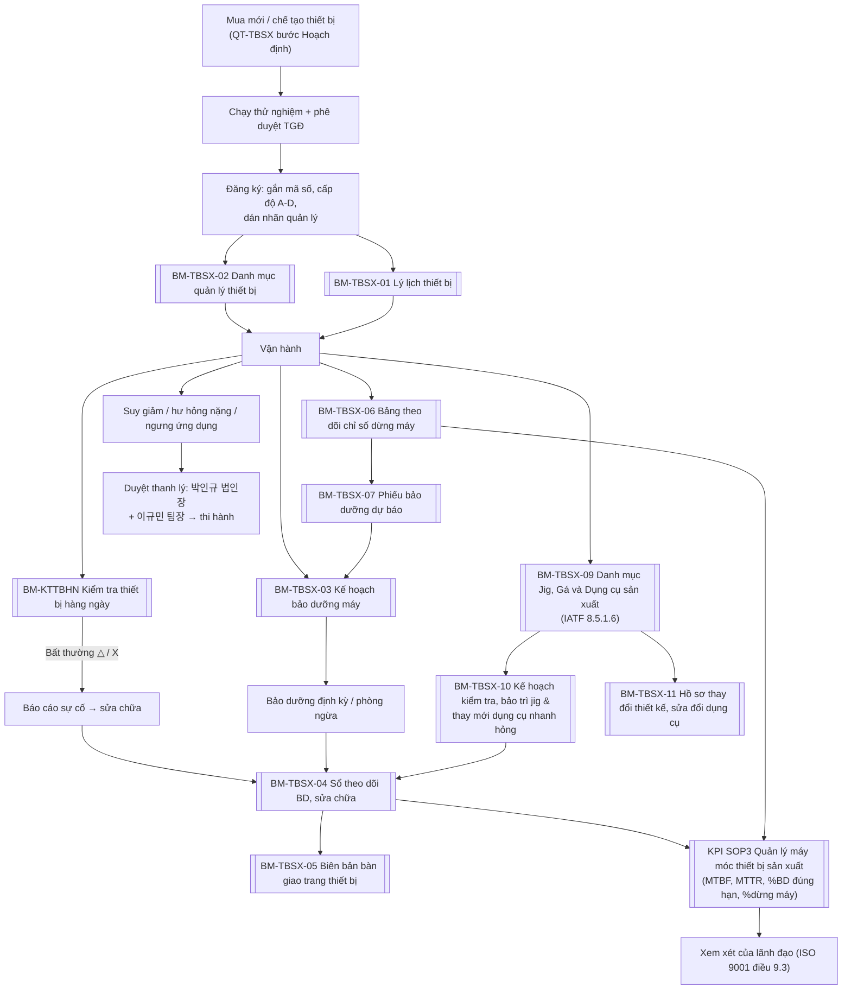

---
tags:
  - IATF16949
  - quan-ly-thiet-bi
  - moc
aliases:
  - MOC Quản lý thiết bị
  - Trang chủ hệ thống TBSX
standard: IATF 16949:2016 — 8.5.1.5, 8.5.1.6
created: 2026-08-21
---

# 00 · Mục lục — Hệ thống Quản lý Thiết bị sản xuất

> [!tip] Điểm bắt đầu cho Mr.TAN
>
> Mở [[00 Cẩm nang Phan Minh Tấn - Quản lý Kỹ thuật Thiết bị]] để xem nhanh nhiệm vụ, biểu mẫu, quyền hạn và việc cần làm.

> [!abstract] Tổng quan
> Hệ thống tài liệu **Quản lý thiết bị sản xuất** của Công ty TNHH COREELECTRONICS VN, đối chiếu tiêu chuẩn **IATF 16949:2016 — điều 8.5.1.5 (Duy trì năng suất tổng thể)** và **8.5.1.6 (Quản lý dụng cụ sản xuất, đo kiểm)**.
> Nguồn dữ liệu gốc: thư mục `quy trinh bao tri` — file Excel *CEV-QT-TBSX (Rev 2)*, bản *version 1* và *KPI Target and Quality Objectives Rev01* đã được **bóc toàn bộ nội dung vào hệ thống này rồi xóa ngày 2026-08-21**. Các ghi chú trong vault hiện là nguồn duy nhất. Mọi điểm cần xác nhận đã chốt xong (mã BM-08, mục tiêu downtime 8%).

## 1. Bản đồ tài liệu

| Nhóm      | Tài liệu                                                                     | Mã                    | Phòng quản lý         | Lưu trữ       |
| --------- | ---------------------------------------------------------------------------- | --------------------- | --------------------- | ------------- |
| Quy trình | [[QT-TBSX Quy trình quản lý thiết bị sản xuất]]                              | CEV-QT-TBSX (Rev 3)   | Phòng Sản xuất        | —             |
| Biểu mẫu  | [[BM-TBSX-01 Lý lịch thiết bị]]                                              | CEV-BM-TBSX-01        | Phòng Kỹ thuật        | 10 năm        |
| Biểu mẫu  | [[BM-TBSX-02 Danh mục quản lý thiết bị sản xuất]]                            | CEV-BM-TBSX-02        | Phòng Kỹ thuật        | 10 năm        |
| Biểu mẫu  | [[BM-TBSX-03 Kế hoạch bảo dưỡng máy]]                                        | CEV-BM-TBSX-03        | Phòng Bảo trì         | 10 năm        |
| Biểu mẫu  | [[BM-TBSX-04 Sổ theo dõi bảo dưỡng sửa chữa thiết bị]]                       | CEV-BM-TBSX-04        | Phòng Bảo trì         | 10 năm        |
| Biểu mẫu  | [[BM-TBSX-05 Biên bản bàn giao trang thiết bị]]                              | CEV-BM-TBSX-05        | Phòng Sản xuất        | 10 năm        |
| Biểu mẫu  | [[BM-TBSX-06 Bảng theo dõi chỉ số dừng máy]]                                 | CEV-BM-TBSX-06        | Phòng Bảo trì         | 10 năm        |
| Biểu mẫu  | [[BM-TBSX-07 Phiếu bảo dưỡng dự báo]]                                        | CEV-BM-TBSX-07        | Phòng Kỹ thuật        | 10 năm        |
| Biểu mẫu  | [[BM-KTTBHN Kiểm tra thiết bị hàng ngày]]                                    | CEV-BM-KTTBHN         | Phòng Bảo trì         | ≥1 tháng      |
| Biểu mẫu  | [[BM-TBSX-08 Kết quả bảo dưỡng sửa chữa thiết bị]]                           | CEV-BM-TBSX-08        | Phòng Bảo trì         | 10 năm        |
| Biểu mẫu  | [[BM-TBSX-09 Danh mục Jig, Gá và Dụng cụ sản xuất]]                          | CEV-BM-TBSX-09        | Phòng Kỹ thuật        | 10 năm        |
| Biểu mẫu  | [[BM-TBSX-10 Kế hoạch kiểm tra, bảo trì jig và thay mới dụng cụ nhanh hỏng]] | CEV-BM-TBSX-10        | Phòng Kỹ thuật        | 10 năm        |
| Biểu mẫu  | [[BM-TBSX-11 Hồ sơ thay đổi thiết kế, sửa đổi dụng cụ]]                      | CEV-BM-TBSX-11        | Phòng Kỹ thuật        | 10 năm        |
| KPI       | [[KPI SOP3 Quản lý máy móc thiết bị sản xuất]]                               | theo KPI Target Rev01 | SX + Bộ phận Kỹ thuật | Hàng tháng    |
| KPI       | [[KPI các quy trình khác (trích từ KPI Target Rev01)]]                       | lưu trữ               | Ban IATF · QC · HR…   | Lưu trữ       |
| Hồ sơ     | `03 Hồ sơ thiết bị/` — lý lịch từng thiết bị                                 | theo mã thiết bị      | Phòng Kỹ thuật        | Theo vòng đời |
| Tham khảo | [[Sơ đồ tổ chức CORE Việt Nam]]                                              | —                     | —                     | —             |
| Tham khảo | [[HD - In xuất PDF chuẩn A4 (CSS snippet)]]                                  | print-a4.css          | —                     | —             |
| Công cụ   | [[Dashboard - Lịch bảo trì thiết bị]]                                        | Dataview              | Mr.TAN                | Tự động       |

> [!note] Bản thảo cũ đã dọn dẹp
> Các ghi chú nháp giai đoạn đầu trong `copilot/projects/.../outputs` (BM01 - Kế hoạch bảo dưỡng, BM02 - Phiếu bảo dưỡng dự báo, dùng **mã đề xuất**) đã được **xóa ngày 2026-08-21** sau khi hệ thống chính hoàn tất với đúng mã gốc: Kế hoạch bảo dưỡng = **-03**, Phiếu dự báo = **-07**.

## 2. Luồng vận hành biểu mẫu theo vòng đời thiết bị

## 3. Phân công trách nhiệm

Tên phòng ban trong tài liệu CEV-QT-TBSX được **ánh xạ sang cơ cấu tổ chức thực tế** (chi tiết tại [[Sơ đồ tổ chức CORE Việt Nam]]):

- **Phòng Sản xuất** *(chủ quản quy trình)* → 제조그룹 Nhóm Sản xuất, 그룹장 Mr AN: vận hành thiết bị, báo cáo sự cố; ký [[BM-TBSX-05 Biên bản bàn giao trang thiết bị]]; cùng bộ phận kỹ thuật chịu trách nhiệm [[KPI SOP3 Quản lý máy móc thiết bị sản xuất]]. **Các tổ trưởng line (제조1–4, 가공) giữ biểu mẫu [[BM-KTTBHN Kiểm tra thiết bị hàng ngày]] do Mr.TAN phát hành và tự kiểm tra hằng ngày.**
- **Phòng Kỹ thuật** → 개발기술 파트 Phần Phát triển kỹ thuật, P장 **Mr.TAN**: quản lý [[BM-TBSX-01 Lý lịch thiết bị]], [[BM-TBSX-02 Danh mục quản lý thiết bị sản xuất]], đề xuất [[BM-TBSX-07 Phiếu bảo dưỡng dự báo]]; chủ quản hệ thống jig/gá/dụng cụ theo 8.5.1.6 — [[BM-TBSX-09 Danh mục Jig, Gá và Dụng cụ sản xuất]], [[BM-TBSX-10 Kế hoạch kiểm tra, bảo trì jig và thay mới dụng cụ nhanh hỏng]], [[BM-TBSX-11 Hồ sơ thay đổi thiết kế, sửa đổi dụng cụ]].
- **Phòng Bảo trì** → cũng là **Mr.TAN** *(nhiệm vụ 안전·설비지원)*: [[BM-KTTBHN Kiểm tra thiết bị hàng ngày]], [[BM-TBSX-03 Kế hoạch bảo dưỡng máy]], [[BM-TBSX-04 Sổ theo dõi bảo dưỡng sửa chữa thiết bị]], [[BM-TBSX-06 Bảng theo dõi chỉ số dừng máy]].
- **Phòng QC** → 품질그룹 QA/QC 파트, Ms NGA: hiệu chuẩn thiết bị đo lường (KPI SOP 2), đánh giá tác động của sự cố thiết bị đến chất lượng sản phẩm.
- **Mua vật tư/phụ tùng bảo trì** → theo quy tắc nơi đặt mua — quy định tại [[Phan Minh Tấn - Mô tả công việc R&D và Kỹ thuật Bảo trì]] (mục 4.2).
- **Duyệt thanh lý/phế bỏ thiết bị** → **박인규** (법인장 — Giám đốc pháp nhân) và **이규민** (팀장 제조지원팀) phê duyệt trước khi thi hành (bước 4.2 của [[QT-TBSX Quy trình quản lý thiết bị sản xuất]]).

> [!warning] Rủi ro phụ thuộc một người
>
> Toàn bộ công việc kỹ thuật — thiết bị của nhà máy (lý lịch, danh mục, kế hoạch bảo dưỡng, sổ theo dõi, downtime, phiếu dự báo) đang dồn vào **đúng 1 người: Mr.TAN**, trưởng 개발기술 파트 với tổng nguyên 1명. Các 파트 sản xuất (Breaker 16, Coil Assy 22, Solder/WPC 32, Auto Line 10, Press/Coating 2) chỉ là bên **sử dụng** thiết bị. Đây là điểm yếu tiềm ẩn khi audit IATF. Nên: đào tạo tối thiểu 1 người dự phòng (có thể chọn từ các 파트 sản xuất), và quy định các bước bắt buộc phải có người thứ hai xác nhận (ví dụ ký [[BM-TBSX-05 Biên bản bàn giao trang thiết bị]], phê duyệt [[BM-TBSX-07 Phiếu bảo dưỡng dự báo]]).

## 4. Quy ước mã hóa và cấp độ thiết bị

**Chuỗi phê duyệt tài liệu** (ghi trong Properties của mọi tài liệu chính thức): **Soạn thảo** Phan Tấn (Mr.TAN — 개발기술 파트) → **Xem xét** 이규민 (Lee Kyu Min — 팀장 제조지원팀) → **Duyệt** 박인규 (Pak In Kyu — 법인장). Thuộc tính tương ứng: `drafter` · `reviewer` · `approver` · `status`.

- **Nhãn quản lý thiết bị:** Tên công ty (CEV) · Tên thiết bị · Số series · Nhà sản xuất · Ngày chế tạo/thu mua · Người phụ trách chính/phụ · **Mã số quản lý**, ví dụ `CEV-TB-111202501`.
- **Cấp độ thiết bị** (theo mức ảnh hưởng đến chất lượng sản phẩm):

| Cấp | Tiêu chuẩn                                |
| --- | ----------------------------------------- |
| A   | Ảnh hưởng nặng nề đến chất lượng sản phẩm |
| B   | Ảnh hưởng mức độ vừa phải                 |
| C   | Ảnh hưởng ít                              |
| D   | Không ảnh hưởng                           |

## 5. Việc cần làm tiếp theo

- [x] Chốt mục tiêu downtime KPI 2 = **≤8%/tháng** (theo ô mục tiêu của file gốc; phần chữ *"không quá 5%"* là chỗ chưa được cập nhật).
- [x] Gán mã cho biểu mẫu *Kết quả bảo dưỡng sửa chữa* (file gốc ghi trùng -05 với Biên bản bàn giao) — đã chốt **CEV-BM-TBSX-08**: [[BM-TBSX-08 Kết quả bảo dưỡng sửa chữa thiết bị]].
- [x] Nhập danh mục thiết bị từ file gốc vào [[BM-TBSX-02 Danh mục quản lý thiết bị sản xuất]] — đã chuyển đủ **19 thiết bị** (16 máy Die casting Toyo BD-125V5EX + 1 CNC, 1 tiện, 1 hàn) ngày 2026-08-21; các ô "—" cần rà soát thực tế để bổ sung.
- [x] Bổ sung hệ thống con **IATF 8.5.1.6** (jig/gá/dụng cụ) — tạo [[BM-TBSX-09 Danh mục Jig, Gá và Dụng cụ sản xuất]], [[BM-TBSX-10 Kế hoạch kiểm tra, bảo trì jig và thay mới dụng cụ nhanh hỏng]], [[BM-TBSX-11 Hồ sơ thay đổi thiết kế, sửa đổi dụng cụ]]; cập nhật QT-TBSX lên **Rev 3** (mục 6 mới) ngày 2026-08-21.
- [x] Gắn `status: Approved` + chuỗi phê duyệt (`drafter` Mr.TAN → `reviewer` 이규민 → `approver` 박인규) vào **15 tài liệu chính thức** (QT + 12 BM + 2 KPI) ngày 2026-08-21.
- [x] Dựng [[Dashboard - Lịch bảo trì thiết bị]] bằng Dataview (4 bảng: quá hạn / 7 ngày tới / toàn bộ / đang sửa chữa); template lý lịch đã có sẵn thuộc tính `equipment-status`, `next-pm-date`, `pm-frequency`.
- [ ] **[Audit KMR 21/08/2026 · OBS #18 — Mr.TAN]** Cập nhật hồ sơ bảo trì khi phát sinh, theo cách đã thống nhất (không ghi chi tiết kiểu KMR): sửa chữa/thay phụ tùng → lập **báo cáo sửa chữa** (bằng chứng gốc) + ghi 1 dòng vào [[BM-TBSX-04 Sổ theo dõi bảo dưỡng sửa chữa thiết bị]] *(mã thiết bị · loại công việc "sửa chữa đột xuất" · vật tư/phụ tùng thay thế · người thực hiện · số tham chiếu báo cáo)*; cuối tháng hoặc sau sự cố lớn **chốt 1 dòng tóm tắt** sang [[BM-TBSX-01 Lý lịch thiết bị]] / hồ sơ máy trong `03 Hồ sơ thiết bị/`. Đóng trước tái chứng nhận 07/2027 — nguồn: [[KMR - Báo cáo đánh giá giám sát ISO 9001 & 14001 (2026-08-21)]].
- [ ] **[Audit KMR 21/08/2026 · OFI #4 — Mr.TAN]** Dán nhãn **"Không sử dụng"** cho 2 bình áp lực tại khu máy nén khí — nguồn: [[KMR - Báo cáo đánh giá giám sát ISO 9001 & 14001 (2026-08-21)]].
- [ ] Nhập dữ liệu thực tế cho hệ thống 8.5.1.6: danh sách jig/gá/dụng cụ đang dùng vào [[BM-TBSX-09 Danh mục Jig, Gá và Dụng cụ sản xuất]]; tiêu chuẩn thay mới + tồn kho tối thiểu vào Phần B của [[BM-TBSX-10 Kế hoạch kiểm tra, bảo trì jig và thay mới dụng cụ nhanh hỏng]]; rà soát dụng cụ sở hữu khách hàng cần dán nhãn bền vững.
- [ ] Lập hồ sơ thật cho **16 máy Die casting Toyo** từ [[Mẫu - Lý lịch thiết bị]] (nhân bản, điền `next-pm-date` từng máy) → [[Dashboard - Lịch bảo trì thiết bị]] bắt đầu chạy thật.
- [ ] Lập lý lịch riêng cho từng thiết bị cấp A trong `03 Hồ sơ thiết bị/` — đã có sẵn [[Mẫu - Lý lịch thiết bị]] và ví dụ [[TB-0002 Băng chuyền sấy (CEV-BCS-0002)]], [[TB-CNC-001 Máy phay CNC (XYZ-1000)]].
- [ ] Khi xây dựng hệ thống tài liệu cho các quy trình khác, chuyển nội dung [[KPI các quy trình khác (trích từ KPI Target Rev01)]] về đúng nơi (HR, QC, kho, sale…).
